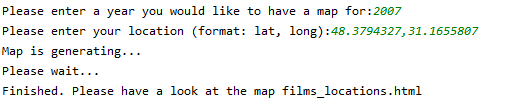
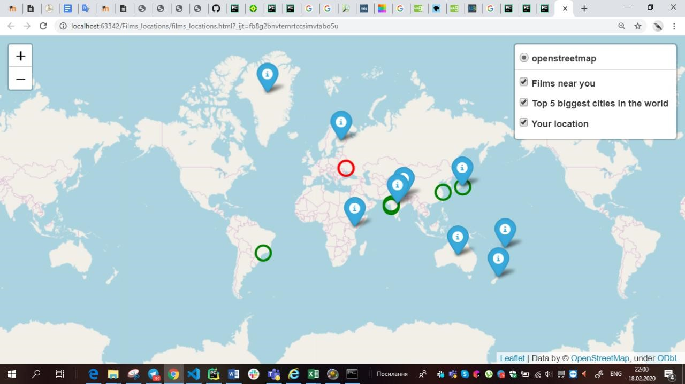

# Films_locations_lab2
### Description
This module films_locations.py returns a map with three layers:
1)	Only your location
2)	Films which were filmed near you
3)	5 biggest cities in the world
The user must write the year of films he/she wants to see and coordinates: latitude and longitude.

 
### HTML tags
<!DOCTYPE html> defines html type of document 
<head> defines information about document
<script> defines the script and links of document
<link> connection with document
<style> defines the style of the document
<meta> provides metadata about the HTML document

 defines a division or a section
 
### The example of module's work

### Summary
The map gives us information about given location, shows it on the map. Also, it shows the nearest films which were filmed in given year. On the third layer we can see 5 biggest cities in the world on the map.

### Author
Anna Pashuk

